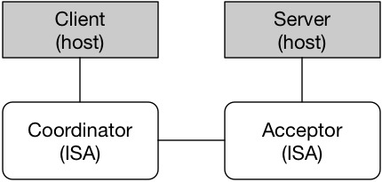

# Description

The goal of NetPaxos is to develop a new set of optimized consensus protocols 
that leverage recent advances in network programmability and hardware design. 
We expect that these protocols will dramatically improve the performance of 
storage and replication systems that are the fundamental infrastructure for 
distributed and cloud computing services.

# Directory Structure
- p4src: contain the P4 and C Sandbox source code to build the firmware for NetPaxos

# Setup

We implement Paxos Coordinator and Acceptor in ISAs. The simplest setup consists
of 1 Coordinator and 1 Acceptor running on ISAs. The application client and server
run on hosts.



# Build
1. To build Coordinator, please include these files in the project
  * headers.p4
  * timestamp.c
  * coordinator.p4
  * coord_rules.p4cfg

2. To build Coordinator, please include these files in the project
  * headers.p4
  * timestamp.c
  * acceptor.p4
  * acceptor.p4cfg


# Run Demo
Please, following the guide in the 
[libnetpaxos](https://github.com/usi-systems/libnetpaxos/tree/netronome) 
repository for building and running the micro benchmark

```
git clone git@github.com:usi-systems/libnetpaxos.git
git checkout netronome
```